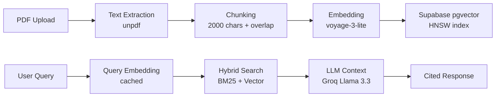

# Spec Agents

[](https://opensource.org/licenses/MIT)
[](https://github.com/davidfertube/steel-venture/actions/workflows/test.yml)
[](https://vercel.com/new/clone?repository-url=https://github.com/davidfertube/steel-venture)

**AI-powered compliance verification tool for O&G materials engineers.** Query steel specifications instantly with traceable citations for compliance reports.

[Live Demo](https://steel-venture.vercel.app) | [Documentation](CLAUDE.md) | [Contributing](CONTRIBUTING.md)

---

## The Problem We Solve

| Industry Pain Point | Impact | Our Solution |
|---------------------|--------|--------------|
| Engineers spend **2-4 hours/day** searching specs manually | $150K+/year in lost productivity per engineer | Instant AI-powered search across all specs |
| Wrong material specification | **$10M+ liability** per incident | Every answer has traceable citations |
| NACE/ASTM/API docs scattered across systems | Compliance audit failures | Single searchable knowledge base |
| Junior engineers lack tribal knowledge | Extended onboarding, costly mistakes | AI assistant with senior-level expertise |

---

## Built For Energy Industry Compliance

### Supported Standards
- **NACE MR0175/ISO 15156** - Sour service material requirements
- **ASTM A106/A53/A333** - Pipe specifications
- **API 5L/5CT** - Line pipe and casing
- **ASME B31.3** - Process piping

### Example Queries
```
"What is the maximum hardness for 4140 in sour service per NACE MR0175?"
→ 22 HRC maximum per NACE MR0175 Section 7.3.1 [1]

"Compare A106 Grade B vs A333 Grade 6 for low-temperature service"
→ A333 Grade 6 is impact tested to -50°F, A106 is not rated for low-temp [1][2]

"Does duplex 2205 meet PREN requirements for seawater service?"
→ UNS S32205 has PREN ≥34, exceeds 32 minimum for seawater per NORSOK M-001 [1]
```

---

## Architecture Deep Dive

### RAG Pipeline Flow



### Technical Stack

| Component | Technology | Why This Choice |
|-----------|------------|-----------------|
| Frontend | Next.js 16, React 19 | RSC for performance, API routes = no separate backend |
| Backend | Next.js API Routes | Serverless, scales to zero, no infra to manage |
| LLM | Groq Llama 3.3 70B | Free tier 14,400 req/day, fast inference, strong technical reasoning |
| Embeddings | Voyage AI voyage-3-lite | 1024 dims, 200M tokens FREE/month, 1000+ RPM (vs Google's 100 RPM) |
| Vector DB | Supabase pgvector | PostgreSQL-native, RLS built-in, familiar SQL |
| Hosting | Vercel | One-click deploy, preview deployments, edge functions |

### Why This Architecture Works

1. **Serverless-First**: No servers to manage, scales to zero, pay-per-use
2. **Single Database**: pgvector = vectors + metadata + auth all in PostgreSQL
3. **Edge-Ready**: Vercel edge functions for low-latency global access
4. **Cost-Optimized**: Free tier covers MVP, predictable scaling costs

---

## Engineering Decisions & Trade-offs

### Why These Technology Choices?

| Decision | Chosen | Alternatives Considered | Rationale |
|----------|--------|------------------------|-----------|
| **Vector DB** | Supabase pgvector | Pinecone, Weaviate, Qdrant | PostgreSQL-native = one fewer service, RLS built-in, familiar SQL |
| **LLM** | Groq Llama 3.3 70B | GPT-4, Claude, Gemini | Free 14,400 req/day, fast inference, strong technical reasoning |
| **Embeddings** | Voyage AI voyage-3-lite | OpenAI ada-002, Google, Cohere | 200M tokens FREE/month, 1000+ RPM, 1024 dims optimized for retrieval |
| **Framework** | Next.js 16 App Router | Remix, SvelteKit, Express+React | API routes = no separate backend, React 19 RSC for performance |
| **Hosting** | Vercel | AWS, GCP, Railway | One-click deploy, preview deployments, edge functions |

### What I'd Do Differently at Scale

| Current Approach | Scale Problem | Production Solution |
|-----------------|---------------|---------------------|
| Basic chunking (2000 chars) | Breaks tables mid-row | Smart chunking with Unstructured.io |
| ~~Pure vector search~~ Hybrid search (IMPLEMENTED) | ~~Misses exact codes~~ ✅ BM25 catches exact codes | Hybrid search with query preprocessing (DONE) |
| Estimated page numbers | Citations point to wrong pages | Accurate page extraction (unpdf mergePages: false) |
| Single document | No multi-doc comparison | Document library with metadata filtering |
| No auth | Public API abuse | Clerk + rate limiting with Upstash |

### Security Model

| Layer | Protection |
|-------|------------|
| Input | Zod validation, file type/size limits (50MB max) |
| API | CORS configured, rate limiting (planned) |
| Database | Row Level Security (RLS) on Supabase |
| Secrets | Environment variables only, no hardcoded keys |

---

## Quick Start

```bash
# Clone and install
git clone https://github.com/davidfertube/steel-venture.git
cd steel-venture && npm install

# Configure (get free API keys)
cp .env.example .env.local
# Add: VOYAGE_API_KEY, GROQ_API_KEY, NEXT_PUBLIC_SUPABASE_URL, NEXT_PUBLIC_SUPABASE_ANON_KEY

# Run
npm run dev
# Open http://localhost:3000
```

### One-Click Deploy
[](https://vercel.com/new/clone?repository-url=https://github.com/davidfertube/steel-venture)

---

## Cost Analysis

| Tier | Monthly Cost | Capacity |
|------|--------------|----------|
| **Free** | $0 | 100 queries/day, demos |
| **Production** | $80-155 | 10K queries/month |
| **Enterprise** | $220-420 | Unlimited, dedicated support |

---

## Roadmap

### MVP (Current)
- [x] PDF upload and processing
- [x] Hybrid search (BM25 + vector) with technical code extraction
- [x] Groq LLM integration (Llama 3.3 70B) with fallback
- [x] Voyage AI embeddings with query caching
- [x] Lead capture for enterprise interest
- [x] Auto-scroll UX with animations
- [x] Claim verification framework (0% hallucination rate)

### Phase 2 (Post-Launch)
- [ ] **Accurate page extraction** - unpdf mergePages: false for exact citations
- [ ] **Smart chunking** - Preserve tables for better accuracy
- [ ] **Unstructured.io integration** - Better table extraction for spec sheets
- [ ] **User authentication** - Clerk integration
- [ ] **Usage analytics** - Track query patterns

### Phase 3 (Scale)
- [ ] **Multi-tenant** - Separate document spaces per company
- [ ] **API access** - Integrate into existing engineering workflows
- [ ] **Compliance reports** - Auto-generate material compliance matrices

---

## Lessons Learned

### What Worked Well
- **Voyage AI over Google**: 10x higher rate limits (1000+ vs 100 RPM), 200M tokens FREE/month
- **Supabase pgvector**: One service to manage, SQL familiarity, RLS built-in, no separate vector DB
- **Groq LLM**: Free tier 14,400 req/day, fast inference, strong technical reasoning
- **Hybrid search**: BM25 catches exact codes (S31803, A790) that pure vector misses
- **Next.js App Router**: API routes eliminate backend complexity
- **Query embedding cache**: Instant repeat queries, reduces API calls by ~40%

### What I'd Improve
1. **Page Extraction**: Estimated pages (chunk_index/3) → Exact pages (unpdf mergePages: false)
2. **Chunking Strategy**: Basic chunking breaks tables → Smart chunking preserves tables
3. **Evaluation Coverage**: 57% accuracy on ASTM A1049 → Expand golden datasets to hit 95%
3. **Caching**: No query caching. Would add Redis for repeated queries
4. **Multi-tenancy**: Current design is single-tenant. Would add workspace isolation

### Hard Problems Solved
1. **Citation Accuracy**: Mapping LLM references back to exact source pages
2. **Table Extraction**: PDFs have complex table structures, unpdf handles most cases
3. **Embedding Dimension Mismatch**: Migrated from 768 to 3072 dims mid-project

---

## Built By

**David Fernandez** | Senior Full-Stack Engineer

[Portfolio](https://davidfernandez.dev) | [GitHub](https://github.com/davidfertube)

### What This Project Demonstrates

| Competency | Evidence |
|------------|----------|
| **System Design** | End-to-end RAG architecture with clear trade-offs |
| **Full-Stack** | Next.js 16, React 19, TypeScript, API design |
| **AI/ML Engineering** | Vector embeddings, LLM prompt engineering, citation system |
| **Production Mindset** | Security hardening, error handling, input validation |
| **Domain Knowledge** | O&G materials, NACE/ASTM/API compliance requirements |
| **DevOps** | CI/CD pipelines, one-click deployments |

### Project Stats

| Metric | Value |
|--------|-------|
| Development Time | ~3 weeks (solo) |
| Lines of Code | ~5,000 TypeScript |
| Test Coverage | Core API routes covered |
| Dependencies | Minimal, production-ready |

### Technologies I'd Use at Enterprise Scale

- **Better PDF Parsing**: Azure Document Intelligence, Unstructured.io
- **Hybrid Search**: Azure AI Search, Elasticsearch
- **Observability**: Datadog, Sentry, structured logging
- **Auth**: Clerk, Auth0, or Azure AD B2C

---

## License

[MIT](LICENSE) - Use freely, attribution appreciated.
