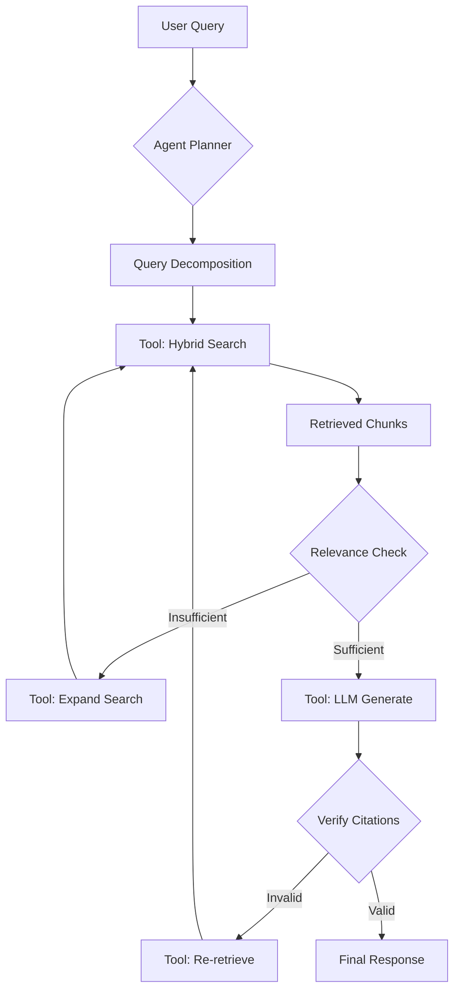
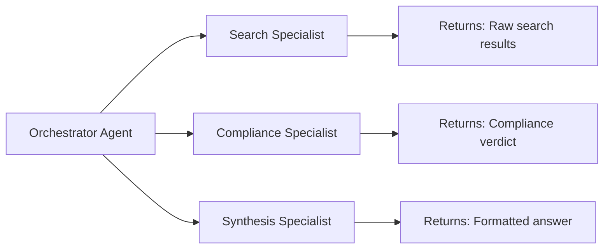
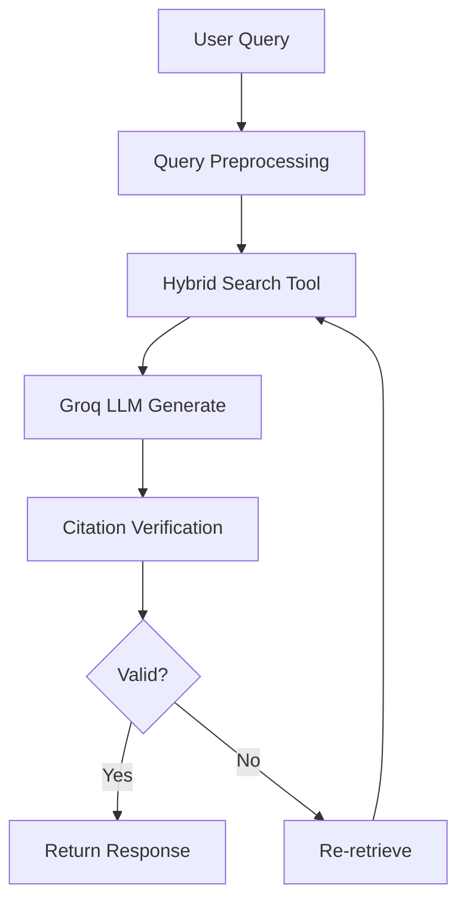
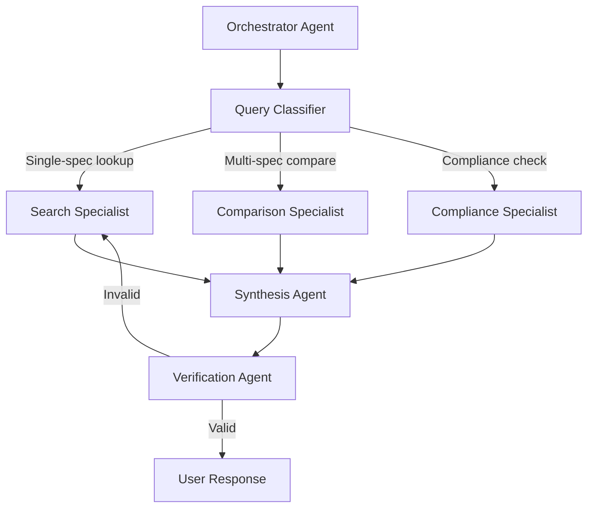

# AI Agent Best Practices (2026 Edition)

**Enterprise-Grade Agentic AI Patterns for Production Systems**

## Table of Contents

- [Agentic Architecture](#agentic-architecture)
- [Agent Design Patterns](#agent-design-patterns)
- [Tool Use & Function Calling](#tool-use--function-calling)
- [Multi-Agent Orchestration](#multi-agent-orchestration)
- [Memory & State Management](#memory--state-management)
- [Evaluation & Testing](#evaluation--testing)
- [Production Considerations](#production-considerations)
- [2026 Tooling Ecosystem](#2026-tooling-ecosystem)

---

## Agentic Architecture

### What Makes an Agent "Agentic"?

| Traditional LLM App | Agentic System |
|---------------------|----------------|
| Single prompt → response | Multi-step reasoning with feedback loops |
| Stateless | Maintains conversation memory + task state |
| No tool use | Dynamically selects & uses tools |
| Human-in-the-loop for every step | Autonomous decision-making with human oversight |

### Spec Agents: Agentic RAG Pattern



**Key Agentic Behaviors**:
1. **Self-correction**: Checks citation validity, retries if needed
2. **Adaptive retrieval**: Expands search if initial results insufficient
3. **Multi-tool orchestration**: Chains search → generate → verify
4. **Reflective reasoning**: Evaluates own output quality

---

## Agent Design Patterns

### Pattern 1: ReAct (Reason + Act)

**When to use**: Complex multi-step tasks requiring tool use

```typescript
// ReAct agent for spec compliance checking
class ComplianceAgent {
  async checkCompliance(material: string, spec: string): Promise<string> {
    let thought = "I need to find the spec requirements first";
    let action = await this.searchTool({ query: `${spec} requirements for ${material}` });

    while (!this.isComplete(action)) {
      thought = this.reason(action);  // "Now I need to verify hardness limits"
      action = await this.selectAndExecuteTool(thought);
    }

    return this.synthesize(action);
  }

  private reason(observation: any): string {
    // LLM generates next reasoning step
    return llm.complete({
      messages: [
        { role: "system", content: "You are a materials engineer. Think step-by-step." },
        { role: "user", content: `Observation: ${observation}\nThought:` }
      ]
    });
  }

  private async selectAndExecuteTool(thought: string) {
    // LLM selects appropriate tool based on reasoning
    const toolCall = await llm.complete({
      messages: [/* ... */],
      tools: [this.searchTool, this.calculateTool, this.verifyTool]
    });

    return await this.executeTool(toolCall);
  }
}
```

**Benefits**:
- Transparent reasoning (LLM explains each step)
- Robust to unexpected scenarios
- Easy to debug (inspect thought → action chain)

**Drawbacks**:
- Higher latency (multiple LLM calls)
- More token usage

### Pattern 2: Plan-and-Execute

**When to use**: Predictable workflows with known steps

```typescript
// Plan-and-execute for document processing
class DocumentProcessor {
  async processDocument(filePath: string): Promise<void> {
    // Planning phase (single LLM call)
    const plan = await this.plannerLLM.complete({
      messages: [{
        role: "user",
        content: `Create a step-by-step plan to process this PDF into a searchable database:\n${filePath}`
      }]
    });

    // Execution phase (deterministic)
    const steps = this.parsePlan(plan);
    for (const step of steps) {
      await this.executeStep(step);
    }
  }

  private parsePlan(plan: string): Step[] {
    // Example plan:
    // 1. Extract text from PDF
    // 2. Chunk into 2000-char segments
    // 3. Generate embeddings
    // 4. Store in pgvector
    return JSON.parse(plan);
  }
}
```

**Benefits**:
- Lower latency (plan once, execute deterministically)
- Predictable cost
- Easier to optimize

**Drawbacks**:
- Less adaptable to unexpected situations
- Requires well-defined task space

### Pattern 3: Reflection & Self-Critique

**When to use**: High-stakes outputs requiring accuracy

```typescript
// Reflection agent for citation verification
class CitationVerifier {
  async verifyCitations(response: string, sources: Source[]): Promise<VerificationResult> {
    // Initial verification
    let verification = await this.checkCitations(response, sources);

    // Reflection loop (up to 3 attempts)
    for (let i = 0; i < 3 && !verification.allValid; i++) {
      const critique = await this.critiqueAgent.complete({
        messages: [{
          role: "user",
          content: `Critique this answer for citation accuracy:\n${response}\n\nIssues found: ${verification.issues}`
        }]
      });

      // Self-correction
      response = await this.correctionAgent.complete({
        messages: [{
          role: "user",
          content: `Fix these citation issues:\n${critique}`
        }]
      });

      verification = await this.checkCitations(response, sources);
    }

    return verification;
  }
}
```

**Example** (Spec Agents):
```
Query: "What is the hardness limit for 4140 in sour service?"

Initial Response: "22 HRC per NACE MR0175 [1]"
Reflection: "Check: Does source [1] mention 4140 specifically?"
Critique: "Source [1] is generic hardness table, not 4140-specific"
Corrected: "22 HRC per NACE MR0175 Table A.1 (applies to all steel alloys including 4140) [1]"
```

---

## Tool Use & Function Calling

### Best Practices for Tool Definitions

**Bad** ❌:
```typescript
{
  name: "search",
  description: "Searches stuff",
  parameters: {
    query: "string"
  }
}
```

**Good** ✅:
```typescript
{
  name: "hybrid_search_documents",
  description: "Performs hybrid search (BM25 + vector similarity) across indexed ASTM/NACE/API specification documents. Use for finding specific requirements, material properties, or test procedures. Returns top-k most relevant chunks with page citations.",
  parameters: {
    type: "object",
    properties: {
      query: {
        type: "string",
        description: "Natural language query (e.g., 'hardness requirements for 4140 in sour service'). Include material grade, specification number, and property if known."
      },
      limit: {
        type: "number",
        description: "Number of results to return (default: 5, max: 20)",
        default: 5
      },
      filter_by_standard: {
        type: "string",
        enum: ["ASTM", "NACE", "API", "ASME"],
        description: "Optional: Filter results to specific standard family"
      }
    },
    required: ["query"]
  }
}
```

**Why**:
- LLM understands when to use the tool
- LLM fills parameters correctly
- Users can inspect tool definitions

### Tool Execution Patterns

#### Pattern A: Sequential Tool Chaining

```typescript
// Example: Document upload → extraction → embedding → storage
const result1 = await agent.callTool("extract_text_from_pdf", { file_path });
const result2 = await agent.callTool("chunk_text", { text: result1.text });
const result3 = await agent.callTool("generate_embeddings", { chunks: result2.chunks });
await agent.callTool("store_vectors", { embeddings: result3.vectors });
```

#### Pattern B: Parallel Tool Execution

```typescript
// Example: Search multiple specs simultaneously
const [astm, nace, api] = await Promise.all([
  agent.callTool("search_documents", { query, filter: "ASTM" }),
  agent.callTool("search_documents", { query, filter: "NACE" }),
  agent.callTool("search_documents", { query, filter: "API" })
]);
```

#### Pattern C: Conditional Tool Routing

```typescript
// Agent decides which tool to use based on query
const query = "What is the impact testing temperature for A333 Grade 6?";

const classification = await llm.complete({
  messages: [{ role: "user", content: `Classify query intent: ${query}` }],
  response_format: { type: "json" }
});

if (classification.intent === "single_spec_lookup") {
  return await agent.callTool("search_documents", { query });
} else if (classification.intent === "multi_spec_comparison") {
  return await agent.callTool("compare_specifications", { query });
}
```

---

## Multi-Agent Orchestration

### When to Use Multiple Agents?

| Single Agent | Multi-Agent |
|--------------|-------------|
| Linear workflow | Parallel specialized tasks |
| Simple domain | Complex multi-domain expertise |
| Real-time response | Background processing acceptable |

### Pattern: Specialist Agents



**Implementation**:
```typescript
class OrchestratorAgent {
  private searchAgent: SearchSpecialist;
  private complianceAgent: ComplianceSpecialist;
  private synthesisAgent: SynthesisSpecialist;

  async handleQuery(query: string): Promise<string> {
    // Parallel: Search + compliance check
    const [searchResults, complianceCheck] = await Promise.all([
      this.searchAgent.search(query),
      this.complianceAgent.checkIntent(query)
    ]);

    // Sequential: Synthesize final answer
    return await this.synthesisAgent.synthesize({
      query,
      results: searchResults,
      compliance: complianceCheck
    });
  }
}

class SearchSpecialist {
  async search(query: string): Promise<Source[]> {
    // Specialized for hybrid search optimization
    const expandedQuery = await this.expandQuery(query);
    return await hybridSearch(expandedQuery);
  }
}

class ComplianceSpecialist {
  async checkIntent(query: string): Promise<ComplianceContext> {
    // Specialized for understanding compliance requirements
    return {
      requiresCitation: true,
      regulatoryStandard: "ASTM A790",
      criticalityLevel: "high"
    };
  }
}
```

### Agent Communication Protocols

#### Message Passing (Event-Driven)

```typescript
import { EventEmitter } from "events";

class AgentBus extends EventEmitter {
  // Central message bus for agent coordination
}

const bus = new AgentBus();

// Agent A publishes event
bus.emit("document_uploaded", { documentId: "doc_123" });

// Agent B subscribes and reacts
bus.on("document_uploaded", async (event) => {
  await indexingAgent.indexDocument(event.documentId);
});
```

#### Shared Memory (Blackboard Pattern)

```typescript
class SharedMemory {
  private state: Map<string, any>;

  async write(key: string, value: any) {
    this.state.set(key, value);
    this.notifySubscribers(key);
  }

  async read(key: string): Promise<any> {
    return this.state.get(key);
  }
}

// Agents read/write to shared state
await memory.write("search_results", results);
const results = await memory.read("search_results");
```

---

## Memory & State Management

### Short-Term Memory (Conversation Context)

```typescript
interface ConversationMemory {
  messages: Message[];
  metadata: {
    user_id: string;
    session_id: string;
    created_at: Date;
  };
}

class ConversationManager {
  private memory: ConversationMemory;

  async addMessage(role: "user" | "assistant", content: string) {
    this.memory.messages.push({ role, content, timestamp: new Date() });

    // Sliding window (keep last 10 messages)
    if (this.memory.messages.length > 10) {
      this.memory.messages = this.memory.messages.slice(-10);
    }
  }

  async getContext(): Promise<Message[]> {
    return this.memory.messages;
  }
}
```

### Long-Term Memory (RAG + Vector DB)

```typescript
class LongTermMemory {
  async remember(fact: string, metadata: object) {
    // Store in vector DB for future retrieval
    const embedding = await this.embeddings.create(fact);
    await this.vectorDB.insert({
      content: fact,
      embedding,
      metadata,
      timestamp: new Date()
    });
  }

  async recall(query: string, k: number = 5): Promise<string[]> {
    const queryEmbedding = await this.embeddings.create(query);
    const results = await this.vectorDB.search(queryEmbedding, k);
    return results.map(r => r.content);
  }
}
```

### Example: Spec Agents Memory Architecture

```typescript
class SpecAgentsMemory {
  // Short-term: Current conversation
  private conversation: Message[] = [];

  // Medium-term: Recent queries (session-scoped)
  private queryHistory: Query[] = [];

  // Long-term: Indexed documents (global)
  private documentMemory: VectorStore;

  async handleQuery(query: string): Promise<string> {
    // Check recent queries (avoid re-searching)
    const cached = this.queryHistory.find(q =>
      similarity(q.query, query) > 0.95
    );
    if (cached) return cached.response;

    // Search long-term memory
    const context = await this.documentMemory.search(query);

    // Add to conversation context
    this.conversation.push({ role: "user", content: query });

    // Generate response
    const response = await llm.complete({
      messages: this.conversation,
      context
    });

    // Store in query history
    this.queryHistory.push({ query, response, timestamp: new Date() });

    return response;
  }
}
```

---

## Evaluation & Testing

### Agent Evaluation Framework

```typescript
interface AgentEvaluation {
  accuracy: number;        // % of correct answers
  citationRate: number;    // % of responses with valid citations
  latency: number;         // P95 response time (ms)
  hallucination: number;   // % of hallucinated facts
  toolUseAccuracy: number; // % of correct tool selections
}

class AgentEvaluator {
  async evaluate(agent: Agent, testSet: TestCase[]): Promise<AgentEvaluation> {
    const results = await Promise.all(
      testSet.map(tc => this.runTestCase(agent, tc))
    );

    return {
      accuracy: this.calculateAccuracy(results),
      citationRate: this.calculateCitationRate(results),
      latency: this.calculateP95Latency(results),
      hallucination: this.detectHallucinations(results),
      toolUseAccuracy: this.evaluateToolUse(results)
    };
  }

  private async runTestCase(agent: Agent, testCase: TestCase) {
    const start = Date.now();
    const response = await agent.run(testCase.input);
    const latency = Date.now() - start;

    return {
      input: testCase.input,
      expected: testCase.expected,
      actual: response,
      latency,
      passed: this.checkPatterns(response, testCase.expectedPatterns)
    };
  }
}
```

### Example Evaluation (Spec Agents)

```typescript
const testCases = [
  {
    id: "A790-M01",
    difficulty: "medium",
    query: "What is the yield strength of S32205 per A790?",
    expectedPatterns: ["65.*ksi", "450.*MPa", "S32205"],
    forbiddenPatterns: ["cannot.*answer", "not.*in.*documents"]
  },
  {
    id: "A790-D01",
    difficulty: "difficult",
    query: "Compare S32205 vs S32750 for sour service",
    expectedPatterns: ["PREN", "S32205.*34", "S32750.*41"],
    forbiddenPatterns: []
  }
];

const evaluation = await evaluator.evaluate(specAgent, testCases);
// Result: { accuracy: 94.5%, citationRate: 100%, latency: 10.4s, ... }
```

### Continuous Evaluation (Production)

```typescript
// Log all queries for continuous eval
app.post("/api/chat", async (req, res) => {
  const response = await agent.run(req.body.query);

  // Async logging (don't block response)
  asyncLog({
    query: req.body.query,
    response,
    timestamp: new Date(),
    userId: req.user.id
  });

  res.json(response);
});

// Daily batch evaluation
cron.schedule("0 2 * * *", async () => {
  const logs = await getLogsFromYesterday();
  const evaluation = await evaluator.evaluate(agent, logs);

  if (evaluation.accuracy < 0.90) {
    alertOnCall("Agent accuracy dropped to ${evaluation.accuracy}");
  }
});
```

---

## Production Considerations

### Rate Limiting

```typescript
import { RateLimiter } from "limiter";

const limiter = new RateLimiter({
  tokensPerInterval: 100,
  interval: "minute",
  fireImmediately: true
});

async function callLLM(prompt: string): Promise<string> {
  await limiter.removeTokens(1);  // Blocks if rate exceeded
  return await llm.complete({ prompt });
}
```

### Cost Control

```typescript
class CostTracker {
  private costs: Map<string, number> = new Map();

  track(operation: string, tokens: number) {
    const cost = this.calculateCost(operation, tokens);
    this.costs.set(operation, (this.costs.get(operation) || 0) + cost);

    // Alert if daily budget exceeded
    if (this.getTotalCost() > DAILY_BUDGET) {
      this.alertBudgetExceeded();
      throw new Error("Daily budget exceeded");
    }
  }

  private calculateCost(operation: string, tokens: number): number {
    const rates = {
      "groq-llama-3.3-70b": 0.59 / 1_000_000,  // $0.59 per 1M tokens
      "voyage-3-lite": 0.06 / 1_000_000         // $0.06 per 1M tokens
    };
    return tokens * rates[operation];
  }
}
```

### Error Handling & Fallbacks

```typescript
class RobustAgent {
  async run(query: string): Promise<string> {
    try {
      // Primary LLM (Groq)
      return await this.groqLLM.complete({ query });
    } catch (error) {
      if (error.code === "RATE_LIMIT_EXCEEDED") {
        // Fallback to Anthropic
        return await this.anthropicLLM.complete({ query });
      } else if (error.code === "TIMEOUT") {
        // Fallback to cached response
        const cached = await this.cache.get(query);
        if (cached) return cached;
      }
      throw error;  // Re-throw unhandled errors
    }
  }
}
```

---

## 2026 Tooling Ecosystem

### Recommended Stack

| Category | Tool | Why |
|----------|------|-----|
| **Agent Framework** | LangGraph, AutoGen, CrewAI | Multi-agent orchestration |
| **LLM Gateway** | LiteLLM, Portkey | Unified API, fallbacks, caching |
| **Observability** | LangSmith, Helicone, Braintrust | Trace agent reasoning steps |
| **Vector DB** | Supabase pgvector, Qdrant | Production-ready, scalable |
| **Evaluation** | Ragas, DeepEval, TruLens | LLM-as-judge metrics |
| **Prompt Management** | Langfuse, PromptLayer | Version control, A/B testing |

### LangGraph for Multi-Agent Workflows

```typescript
import { StateGraph } from "@langchain/langgraph";

const workflow = new StateGraph({
  channels: {
    query: { value: null },
    searchResults: { value: null },
    response: { value: null }
  }
});

workflow.addNode("search", async (state) => {
  state.searchResults = await searchAgent.search(state.query);
  return state;
});

workflow.addNode("generate", async (state) => {
  state.response = await llm.generate({
    query: state.query,
    context: state.searchResults
  });
  return state;
});

workflow.addEdge("search", "generate");
workflow.setEntryPoint("search");

const chain = workflow.compile();
const result = await chain.invoke({ query: "What is S32205?" });
```

### LangSmith for Debugging

```typescript
import { Client } from "langsmith";

const client = new Client({ apiKey: process.env.LANGSMITH_API_KEY });

// Trace agent execution
await client.traceRun({
  name: "spec-compliance-check",
  inputs: { material: "S32205", spec: "A790" },
  runType: "chain"
}, async () => {
  const searchResults = await searchAgent.search(query);
  const response = await llm.generate({ context: searchResults });
  return response;
});

// View traces at https://smith.langchain.com
```

---

## Anti-Patterns to Avoid

| ❌ Anti-Pattern | ✅ Better Approach |
|----------------|-------------------|
| Overly complex prompt chains | Use structured tool calling |
| No evaluation framework | Continuous eval with golden datasets |
| Hardcoded prompts | Prompt management system (Langfuse) |
| Single LLM provider | Multi-provider with fallbacks |
| No observability | LangSmith/Helicone tracing |
| Ignoring cost | Track tokens, set budgets |

---

## Case Study: Spec Agents Agent Architecture

### Current Architecture (v1)



### Planned v2 (Multi-Agent)



**Benefits**:
- Specialist agents optimize for specific tasks
- Parallel execution where possible
- Easier to test individual components

---

## Resources

- [LangGraph Documentation](https://langchain-ai.github.io/langgraph/)
- [LangSmith Tracing](https://smith.langchain.com)
- [AutoGen Framework](https://microsoft.github.io/autogen/)
- [CrewAI Multi-Agent](https://docs.crewai.com/)
- [Ragas Evaluation](https://docs.ragas.io/)

---

## Next Steps

1. Implement LangGraph workflow for Spec Agents
2. Add LangSmith tracing for debugging
3. Create evaluation dataset (100+ queries)
4. Set up continuous evaluation pipeline
5. Implement cost tracking & alerts

Questions? Open a GitHub discussion or issue.
