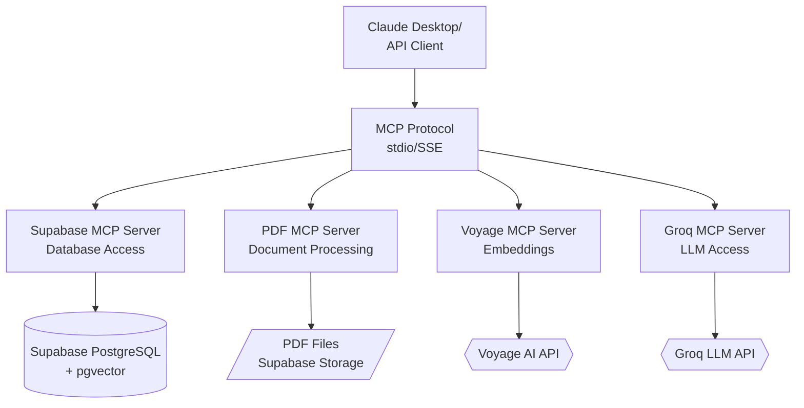
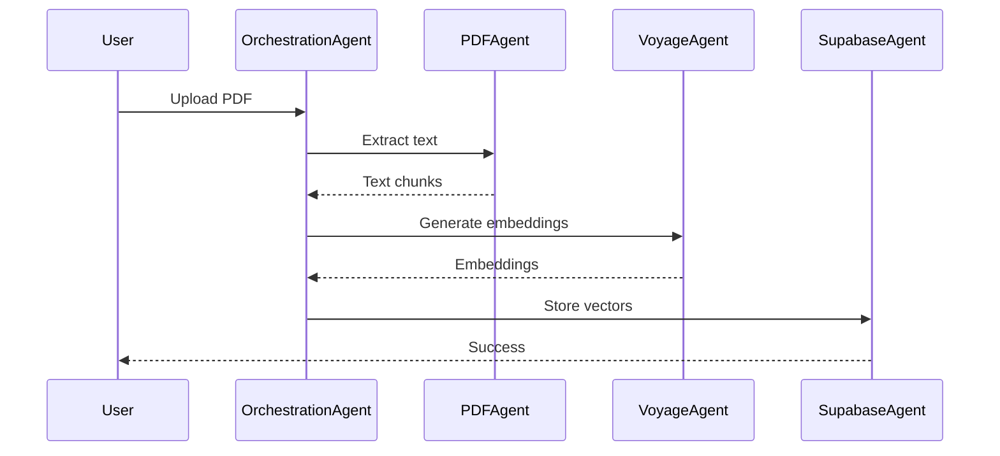

# Model Context Protocol (MCP) Integration Guide

## Overview

This document details enterprise-grade MCP integration patterns for Spec Agents, following 2026 best practices for agentic AI systems.

## Table of Contents

- [What is MCP?](#what-is-mcp)
- [Architecture Integration](#architecture-integration)
- [MCP Servers for Spec Agents](#mcp-servers-for-spec-agents)
- [Implementation](#implementation)
- [Security & Compliance](#security--compliance)
- [Monitoring & Observability](#monitoring--observability)

---

## What is MCP?

**Model Context Protocol** is an open standard protocol that enables:
- **Context Sharing**: AI agents access external data sources (databases, APIs, files)
- **Tool Orchestration**: Multi-agent coordination via standardized interfaces
- **Prompt Management**: Centralized prompt templates with version control
- **Resource Access**: Secure, governed access to company data

### Why MCP for Spec Agents?

| Traditional Approach | MCP Approach | Benefit |
|---------------------|--------------|---------|
| Hardcoded DB connections | MCP Supabase server | Swappable data sources |
| Custom API wrappers | MCP tool definitions | Standardized interfaces |
| Embedded prompts | MCP prompt resources | Version-controlled prompts |
| Manual auth | MCP OAuth flows | Enterprise SSO integration |

---

## Architecture Integration

### MCP Server Topology for Spec Agents



### Benefits of MCP Architecture

1. **Modularity**: Swap Groq → OpenAI without changing client code
2. **Security**: MCP servers enforce auth/permissions centrally
3. **Observability**: Centralized logging, tracing, metrics
4. **Testing**: Mock MCP servers for integration tests

---

## MCP Servers for Spec Agents

### 1. Supabase MCP Server (Data Layer)

**Purpose**: Access documents, embeddings, metadata

**Available Tools**:
```typescript
{
  "tools": [
    {
      "name": "query_documents",
      "description": "Hybrid search (BM25 + vector) across indexed documents",
      "parameters": {
        "query": "string",
        "limit": "number",
        "filters": "object"
      }
    },
    {
      "name": "get_document",
      "description": "Retrieve full document content and metadata",
      "parameters": {
        "document_id": "string"
      }
    },
    {
      "name": "list_documents",
      "description": "List all indexed documents with metadata",
      "parameters": {
        "filter_by_standard": "string (optional)",
        "filter_by_date": "string (optional)"
      }
    }
  ]
}
```

**Implementation**:
```bash
# Install MCP Supabase server
npm install -g @modelcontextprotocol/server-supabase

# Configure in claude_desktop_config.json
{
  "mcpServers": {
    "supabase": {
      "command": "npx",
      "args": ["-y", "@modelcontextprotocol/server-supabase"],
      "env": {
        "SUPABASE_URL": "https://your-project.supabase.co",
        "SUPABASE_SERVICE_KEY": "your-service-role-key"
      }
    }
  }
}
```

### 2. PDF Processing MCP Server (Custom)

**Purpose**: Extract, chunk, and process PDF documents

**Available Tools**:
```typescript
{
  "tools": [
    {
      "name": "upload_and_index_pdf",
      "description": "Upload PDF, extract text, generate embeddings, store in pgvector",
      "parameters": {
        "file_path": "string",
        "metadata": {
          "standard": "string",
          "revision": "string",
          "effective_date": "string"
        }
      }
    },
    {
      "name": "extract_table_from_pdf",
      "description": "Extract structured table data from PDF page",
      "parameters": {
        "document_id": "string",
        "page_number": "number"
      }
    }
  ]
}
```

**Implementation** (TypeScript):
```typescript
// mcp-servers/pdf-processor/index.ts
import { Server } from "@modelcontextprotocol/sdk/server/index.js";
import { StdioServerTransport } from "@modelcontextprotocol/sdk/server/stdio.js";
import { extractTextFromPDF, chunkDocument } from "@/lib/pdf-utils";

const server = new Server(
  {
    name: "spec-agents-pdf-processor",
    version: "1.0.0",
  },
  {
    capabilities: {
      tools: {},
    },
  }
);

server.setRequestHandler("tools/call", async (request) => {
  if (request.params.name === "upload_and_index_pdf") {
    const { file_path, metadata } = request.params.arguments;

    // Extract text
    const text = await extractTextFromPDF(file_path);

    // Chunk document (preserve tables)
    const chunks = await chunkDocument(text, {
      chunkSize: 2000,
      overlap: 200,
      preserveTables: true
    });

    // Generate embeddings (via Voyage MCP)
    // Store in Supabase (via Supabase MCP)

    return {
      content: [
        {
          type: "text",
          text: JSON.stringify({
            document_id: "doc_123",
            chunks_created: chunks.length,
            status: "indexed"
          })
        }
      ]
    };
  }
});

const transport = new StdioServerTransport();
await server.connect(transport);
```

### 3. Voyage AI MCP Server (Embeddings)

**Configuration**:
```json
{
  "mcpServers": {
    "voyage": {
      "command": "node",
      "args": ["./mcp-servers/voyage/index.js"],
      "env": {
        "VOYAGE_API_KEY": "your-api-key"
      }
    }
  }
}
```

### 4. Groq LLM MCP Server (Inference)

**Purpose**: LLM completions with fallback handling

**Tools**:
```typescript
{
  "tools": [
    {
      "name": "generate_completion",
      "description": "Generate LLM completion with automatic fallback (Groq → Anthropic → OpenAI)",
      "parameters": {
        "prompt": "string",
        "system": "string",
        "model": "string (optional)",
        "temperature": "number (optional)"
      }
    }
  ]
}
```

---

## Implementation Patterns

### Pattern 1: Multi-Agent Orchestration

**Use Case**: Document processing pipeline



**Implementation**:
```typescript
// Agent orchestrator using MCP
import { Client } from "@modelcontextprotocol/sdk/client/index.js";

class DocumentProcessor {
  private pdfClient: Client;
  private voyageClient: Client;
  private supabaseClient: Client;

  async processDocument(filePath: string) {
    // Step 1: Extract via PDF MCP server
    const extractResult = await this.pdfClient.callTool({
      name: "extract_text",
      arguments: { file_path: filePath }
    });

    // Step 2: Generate embeddings via Voyage MCP server
    const embeddings = await this.voyageClient.callTool({
      name: "create_embeddings",
      arguments: { texts: extractResult.chunks }
    });

    // Step 3: Store via Supabase MCP server
    await this.supabaseClient.callTool({
      name: "insert_document",
      arguments: {
        chunks: extractResult.chunks,
        embeddings: embeddings.vectors
      }
    });
  }
}
```

### Pattern 2: Prompt Resources via MCP

**Purpose**: Version-controlled, reusable prompts

```typescript
// MCP prompt resource definition
{
  "prompts": [
    {
      "name": "spec-compliance-check",
      "description": "Check if material meets specification requirements",
      "arguments": [
        {
          "name": "material",
          "description": "Material designation (e.g., S31803)",
          "required": true
        },
        {
          "name": "specification",
          "description": "ASTM/NACE/API spec (e.g., A790)",
          "required": true
        }
      ],
      "template": "You are a materials compliance expert. Check if {{material}} meets the requirements of {{specification}}. Provide specific section citations for each requirement."
    },
    {
      "name": "compare-specifications",
      "description": "Compare two materials across specifications",
      "template": "Compare {{material1}} and {{material2}} for {{application}}. Focus on: mechanical properties, corrosion resistance, and code compliance."
    }
  ]
}
```

**Usage**:
```typescript
const prompt = await mcpClient.getPrompt({
  name: "spec-compliance-check",
  arguments: {
    material: "S32205",
    specification: "NACE MR0175"
  }
});
```

---

## Security & Compliance

### Authentication Patterns

```typescript
// MCP server with OAuth 2.0 / OIDC
{
  "mcpServers": {
    "supabase": {
      "command": "npx",
      "args": ["-y", "@modelcontextprotocol/server-supabase"],
      "env": {
        "SUPABASE_URL": "https://your-project.supabase.co",
        "SUPABASE_SERVICE_KEY": "${SUPABASE_SERVICE_KEY}" // From vault
      },
      "oauth": {
        "provider": "auth0",
        "client_id": "${AUTH0_CLIENT_ID}",
        "scopes": ["read:documents", "write:documents"]
      }
    }
  }
}
```

### Row-Level Security with MCP

```sql
-- Supabase RLS policy enforced via MCP
CREATE POLICY "Users can only access their org's documents"
ON documents
FOR SELECT
USING (
  organization_id = (
    SELECT organization_id
    FROM users
    WHERE id = auth.uid()
  )
);
```

### Audit Logging

```typescript
// MCP server with built-in audit trail
server.setRequestHandler("tools/call", async (request) => {
  // Log all tool calls
  await auditLog.create({
    user_id: request.context.user_id,
    tool: request.params.name,
    arguments: request.params.arguments,
    timestamp: new Date(),
    ip_address: request.context.ip
  });

  // Execute tool
  const result = await executeTool(request);

  // Log result
  await auditLog.update({
    success: true,
    result_summary: result
  });

  return result;
});
```

---

## Monitoring & Observability

### OpenTelemetry Integration

```typescript
import { trace } from "@opentelemetry/api";

const tracer = trace.getTracer("mcp-pdf-server");

server.setRequestHandler("tools/call", async (request) => {
  const span = tracer.startSpan("tool.call", {
    attributes: {
      "tool.name": request.params.name,
      "user.id": request.context.user_id
    }
  });

  try {
    const result = await executeTool(request);
    span.setStatus({ code: SpanStatusCode.OK });
    return result;
  } catch (error) {
    span.recordException(error);
    span.setStatus({ code: SpanStatusCode.ERROR });
    throw error;
  } finally {
    span.end();
  }
});
```

### Metrics Collection

```typescript
import { metrics } from "@opentelemetry/api";

const meter = metrics.getMeter("mcp-server");
const toolCallCounter = meter.createCounter("tool_calls", {
  description: "Number of MCP tool calls"
});
const toolLatency = meter.createHistogram("tool_latency_ms", {
  description: "Tool call latency in milliseconds"
});

// Instrument tool calls
const start = Date.now();
await executeTool(request);
const duration = Date.now() - start;

toolCallCounter.add(1, { tool: request.params.name });
toolLatency.record(duration, { tool: request.params.name });
```

---

## Production Deployment

### Docker Compose for MCP Servers

```yaml
version: '3.8'

services:
  mcp-pdf-processor:
    build: ./mcp-servers/pdf-processor
    environment:
      - SUPABASE_URL=${SUPABASE_URL}
      - SUPABASE_SERVICE_KEY=${SUPABASE_SERVICE_KEY}
    volumes:
      - ./uploads:/app/uploads
    healthcheck:
      test: ["CMD", "curl", "-f", "http://localhost:8080/health"]
      interval: 30s
      timeout: 10s
      retries: 3

  mcp-voyage:
    build: ./mcp-servers/voyage
    environment:
      - VOYAGE_API_KEY=${VOYAGE_API_KEY}
    deploy:
      replicas: 2  # Scale for high throughput

  mcp-supabase:
    image: modelcontextprotocol/server-supabase:latest
    environment:
      - SUPABASE_URL=${SUPABASE_URL}
      - SUPABASE_SERVICE_KEY=${SUPABASE_SERVICE_KEY}
```

### Kubernetes Deployment

```yaml
apiVersion: apps/v1
kind: Deployment
metadata:
  name: mcp-pdf-processor
spec:
  replicas: 3
  selector:
    matchLabels:
      app: mcp-pdf
  template:
    metadata:
      labels:
        app: mcp-pdf
    spec:
      containers:
      - name: pdf-processor
        image: spec-agents/mcp-pdf:v1.0.0
        env:
        - name: SUPABASE_URL
          valueFrom:
            secretKeyRef:
              name: mcp-secrets
              key: supabase-url
        resources:
          requests:
            memory: "256Mi"
            cpu: "250m"
          limits:
            memory: "512Mi"
            cpu: "500m"
        livenessProbe:
          httpGet:
            path: /health
            port: 8080
          initialDelaySeconds: 30
          periodSeconds: 10
```

---

## Best Practices (2026)

### 1. **Versioning MCP Servers**

```typescript
// Semantic versioning for MCP APIs
const server = new Server({
  name: "spec-agents-pdf",
  version: "2.1.0",  // Major.Minor.Patch
}, {
  capabilities: {
    tools: {
      // v2 tools (backward compatible)
    }
  }
});
```

### 2. **Rate Limiting & Throttling**

```typescript
import { RateLimiter } from "limiter";

const limiter = new RateLimiter({ tokensPerInterval: 100, interval: "minute" });

server.setRequestHandler("tools/call", async (request) => {
  await limiter.removeTokens(1);  // Block if exceeded
  return await executeTool(request);
});
```

### 3. **Circuit Breaker Pattern**

```typescript
import CircuitBreaker from "opossum";

const breaker = new CircuitBreaker(executeTool, {
  timeout: 30000,  // 30s
  errorThresholdPercentage: 50,
  resetTimeout: 60000  // 1 min
});

breaker.on('open', () => {
  console.error('Circuit breaker opened - failing fast');
});
```

### 4. **Schema Validation**

```typescript
import { z } from "zod";

const uploadSchema = z.object({
  file_path: z.string().min(1),
  metadata: z.object({
    standard: z.string(),
    revision: z.string(),
    effective_date: z.string().datetime()
  })
});

server.setRequestHandler("tools/call", async (request) => {
  if (request.params.name === "upload_and_index_pdf") {
    uploadSchema.parse(request.params.arguments);  // Throws if invalid
    return await executeTool(request);
  }
});
```

---

## Testing MCP Servers

### Integration Tests

```typescript
import { Client } from "@modelcontextprotocol/sdk/client/index.js";
import { describe, it, expect } from "vitest";

describe("PDF MCP Server", () => {
  const client = new Client({
    name: "test-client",
    version: "1.0.0"
  });

  beforeAll(async () => {
    await client.connect(/* test transport */);
  });

  it("should extract text from PDF", async () => {
    const result = await client.callTool({
      name: "extract_text",
      arguments: { file_path: "./test.pdf" }
    });

    expect(result.content[0].text).toContain("ASTM");
  });

  it("should handle invalid PDF gracefully", async () => {
    await expect(
      client.callTool({
        name: "extract_text",
        arguments: { file_path: "./invalid.pdf" }
      })
    ).rejects.toThrow("Invalid PDF format");
  });
});
```

---

## Migration Path

### From Monolith to MCP Architecture

**Phase 1**: Extract Supabase access
```typescript
// Before: Direct DB access
const { data } = await supabase.from('documents').select();

// After: Via MCP
const result = await mcpClient.callTool({
  name: "query_documents",
  arguments: { limit: 10 }
});
```

**Phase 2**: Extract PDF processing
**Phase 3**: Extract LLM calls
**Phase 4**: Extract embeddings

---

## Resources

- [MCP Specification](https://spec.modelcontextprotocol.io/)
- [MCP TypeScript SDK](https://github.com/modelcontextprotocol/typescript-sdk)
- [Official MCP Servers](https://github.com/modelcontextprotocol/servers)
- [Example Implementations](https://github.com/modelcontextprotocol/examples)

---

## Support

Questions? Open an issue or discussion on GitHub.
